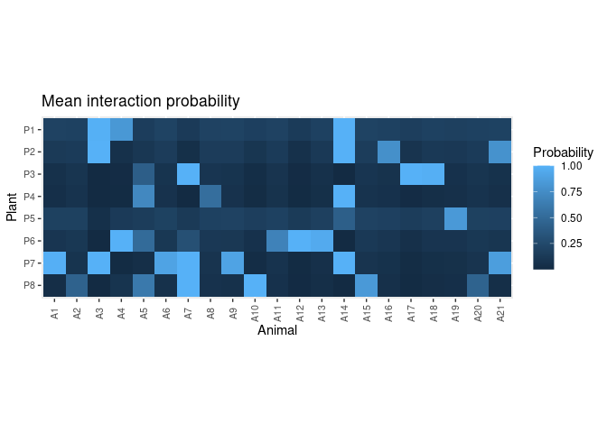
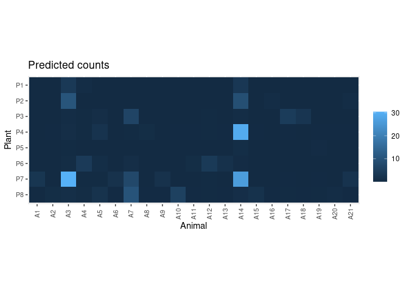
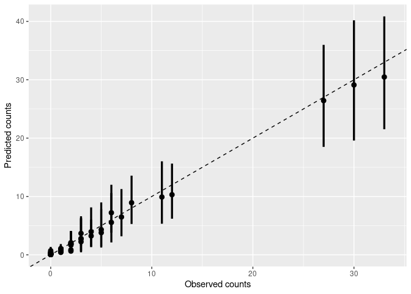

<!-- README.md is generated from README.Rmd. Please edit that file -->

# BayesianNetworks

<!-- badges: start -->


[](https://github.com/Pakillo/BayesianNetworks/actions/workflows/R-CMD-check.yaml)
[](https://lifecycle.r-lib.org/articles/stages.html#stable)
[](https://www.repostatus.org/#active)
[](https://hits.dwyl.com/Pakillo/BayesianNetworks)
[](https://hits.dwyl.com/Pakillo/BayesianNetworks)
<!-- badges: end -->

The BayesianNetworks R package facilitates modelling bipartite networks
(like pollination, frugivory, or herbivory networks) using the Bayesian
framework developed by [Young et
al. (2021)](https://doi.org/10.1038/s41467-021-24149-x).

Inferring the structure of bipartite networks from field (observational)
data is a challenging task. Interaction data are hard to collect and
require typically large sampling efforts, particularly to characterize
infrequent interactions. Inferred network structure is highly sensitive
to sampling design, effort, and completeness. Comparing networks from
different studies without accounting for these sampling effects may lead
to mistaken inferences.

This package uses Bayesian modelling to infer the posterior probability
of each pairwise interaction in bipartite networks, accounting for
sampling completeness and the inherent stochasticity of field
observation data.

## Installation

You can install the development version of BayesianNetworks from
[GitHub](https://github.com/) with:

``` r
# install.packages("remotes")
remotes::install_github("Pakillo/BayesianNetworks")
```

The package requires a working installation of
[Stan](https://mc-stan.org/). If you don’t have `CmdStan` installed,
after installing `BayesianNetworks` run:

``` r
cmdstanr::install_cmdstan()
```

## Example

``` r
library(BayesianNetworks)
```

Let’s infer the structure of an example dataset from [Kaiser-Bunbury et
al. 2017](https://doi.org/10.1038/nature21071) as in Young et al. 2021:

``` r
data(web)
```

This is an adjacency matrix collecting the number of visits of 21
animals on 8 plants:

``` r
web
#>    A1 A2 A3 A4 A5 A6 A7 A8 A9 A10 A11 A12 A13 A14 A15 A16 A17 A18 A19 A20 A21
#> P1  0  0  3  1  0  0  0  0  0   0   0   0   0   4   0   0   0   0   0   0   0
#> P2  0  0 12  0  0  0  0  0  0   0   0   0   0   8   0   1   0   0   0   0   1
#> P3  0  0  0  0  1  0  7  0  0   0   0   0   0   2   0   0   5   3   0   0   0
#> P4  0  0  2  0  3  0  0  1  0   0   0   0   0  30   0   0   0   0   0   0   0
#> P5  0  0  0  0  0  0  0  0  0   0   0   0   0   1   0   0   0   0   1   0   0
#> P6  0  0  0  4  1  0  1  0  0   0   1   5   2   0   0   0   0   0   0   0   0
#> P7  3  0 33  0  0  2  6  0  2   0   0   0   0  27   0   0   0   0   0   0   2
#> P8  0  1  1  1  2  0 11  0  0   6   0   0   0   1   2   0   0   0   0   1   0
```

``` r
plot_counts_obs(web, sort = FALSE)
```


First, prepare the data for modelling. Here we assume constant sampling
effort among plants:

``` r
dt <- prepare_data(mat = web, sampl.eff = rep(20, nrow(web)))
```

Now fit the model. There are several models available: the original
model used in Young et al. (2021), a model that takes into account
varying sampling effort among plants, and a model that allows for
varying preferences among animals. The user can also provide a
customised Stan model. See `fit_model()`.

Here we run 4 parallel chains:

``` r
set.seed(3)
options(mc.cores = 4)
fit <- fit_model(dt, refresh = 0)
#> Running MCMC with 4 parallel chains...
#> 
#> Chain 3 finished in 1.5 seconds.
#> Chain 1 finished in 1.7 seconds.
#> Chain 2 finished in 1.6 seconds.
#> Chain 4 finished in 1.6 seconds.
#> 
#> All 4 chains finished successfully.
#> Mean chain execution time: 1.6 seconds.
#> Total execution time: 1.9 seconds.
```

Check model:

``` r
check_model(fit, data = dt)
#> Processing csv files: /tmp/RtmpSjOIL2/sampling_effort-202407101233-1-5af767.csv, /tmp/RtmpSjOIL2/sampling_effort-202407101233-2-5af767.csv, /tmp/RtmpSjOIL2/sampling_effort-202407101233-3-5af767.csv, /tmp/RtmpSjOIL2/sampling_effort-202407101233-4-5af767.csv
#> 
#> Checking sampler transitions treedepth.
#> Treedepth satisfactory for all transitions.
#> 
#> Checking sampler transitions for divergences.
#> No divergent transitions found.
#> 
#> Checking E-BFMI - sampler transitions HMC potential energy.
#> E-BFMI satisfactory.
#> 
#> Effective sample size satisfactory.
#> 
#> Split R-hat values satisfactory all parameters.
#> 
#> Processing complete, no problems detected.
```


Get the posteriors:

``` r
post <- get_posterior(fit, data = dt)
head(post)
#> # A tibble: 6 × 11
#> # Groups:   Plant, Animal [6]
#>   Plant Animal .chain .iteration .draw connectance preference plant.abund
#>   <chr> <chr>   <int>      <int> <int>       <dbl>      <dbl>       <dbl>
#> 1 P1    A1          1          1     1       0.228       27.3      0.0336
#> 2 P1    A2          1          1     1       0.228       27.3      0.0336
#> 3 P1    A3          1          1     1       0.228       27.3      0.0336
#> 4 P1    A4          1          1     1       0.228       27.3      0.0336
#> 5 P1    A5          1          1     1       0.228       27.3      0.0336
#> 6 P1    A6          1          1     1       0.228       27.3      0.0336
#> # ℹ 3 more variables: animal.abund <dbl>, int.prob <dbl>, link <int>
```

``` r
plot_interaction_prob(post)
```



Predict interaction counts:

``` r
pred.df <- predict_counts(fit, data = dt)
plot_counts_pred(pred.df, sort = FALSE)
```



Compare observed and predicted counts:

``` r
plot_counts_pred_obs(pred.df, data = dt)
```



Plot residuals:

``` r
plot_residuals(pred.df, data = dt, sort = FALSE)
```


## Citation

If you use `BayesianNetworks` please cite it:

``` r
citation("BayesianNetworks")
To cite package 'BayesianNetworks' in publications use:

  Rodriguez-Sanchez F, Young J (2024). _BayesianNetworks: Bayesian
  Modelling of Bipartite Networks_. R package version 0.0.7, commit
  6965aa0904ca23ef532873c2adf797ed76a8a832,
  <https://github.com/Pakillo/BayesianNetworks>.

A BibTeX entry for LaTeX users is

  @Manual{,
    title = {BayesianNetworks: Bayesian Modelling of Bipartite Networks},
    author = {Francisco Rodriguez-Sanchez and Jean-Gabriel Young},
    year = {2024},
    note = {R package version 0.0.7, commit 6965aa0904ca23ef532873c2adf797ed76a8a832},
    url = {https://github.com/Pakillo/BayesianNetworks},
  }
```
